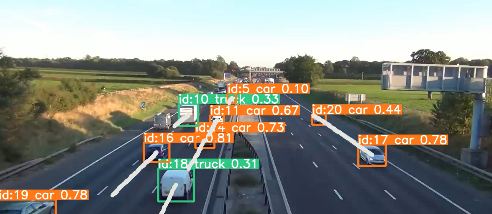
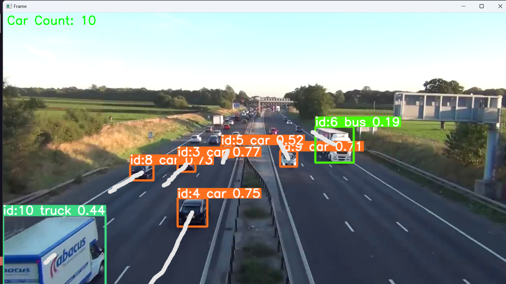
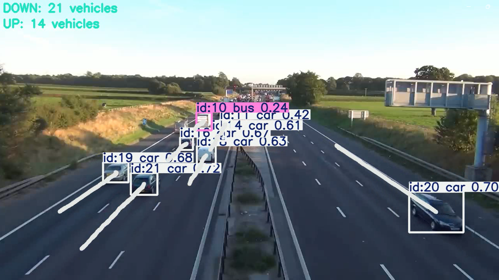

Realtime vehicle traffic tracking using yolov8 model

### Visualization 1



### Visualization 2 : with vehicles counting


### Visualization 3 : with vehicles counting for each road compartment


### Prerequisites
- Python
- Pip 
- OpenCV
- Numpy
- Ultralytics

### Usage

```
py visualization1.py video_path
py visualization2.py video_path
py visualization3.py video_path
```

